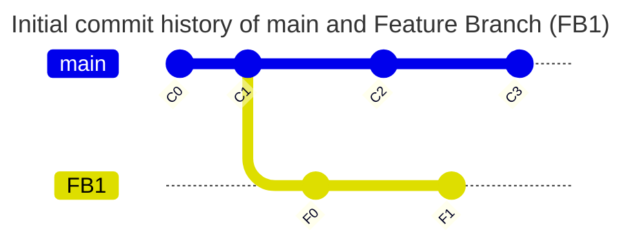
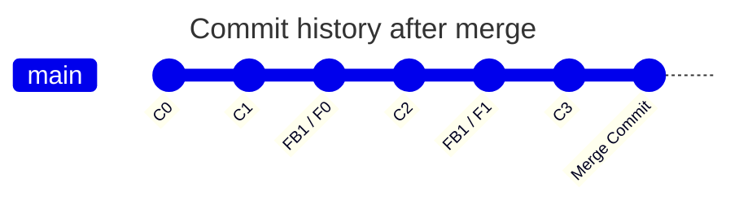
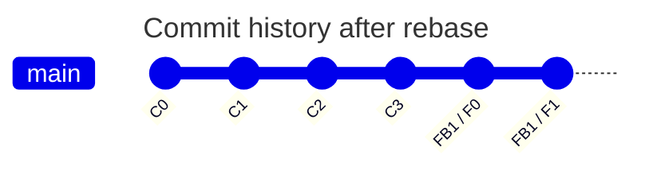
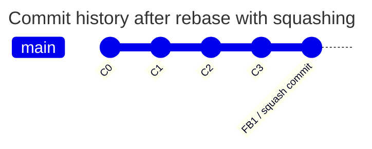

# Documenting git commands/notes 

## Set name and email

```bash
 git config --global user.email "atulthosar@gmail.com"
 git config --global user.name "Atul Thosar"
```
Remove --global flag in case you want to set name/email for local repository only

```bash
git config --global code.editor "vim"
```
## Undo last commit (w/o removing the files)
```bash
git reset --soft HEAD~1
```

## Undo last commit (with removing the files)
```bash
git reset --hard HEAD~1
```

## Git User Stat
List the number of lines added, removed by a particular user

```bash
git log --author="Atul Thosar" --pretty=tformat: --numstat | awk '{ add += $1; subs += $2; loc += $1 - $2 } END { printf "added lines: %s removed lines: %s total lines: %s\n", add, subs, loc }'
```

## Tag operations
```bash
# Create tag
git tag v1.0

# List tags
git tag

# Push tag to remote
git push origin v1.0
```

## Merge Vs Rebase



### If merged performed then history will look like


### If rebase performed then history will look like

### If rebase performed with squashing then history will look like


## Pulling tags from parent repo into forked github repo
```bash
# Assuming you have cloned https://github.com/simplyatul/cilium/ which is created by forking https://github.com/cilium/cilium.git

cd cilium
git remote add upstream https://github.com/cilium/cilium.git
git fetch upstream refs/tags/1.17.0:refs/tags/1.17.0 --no-tags
```